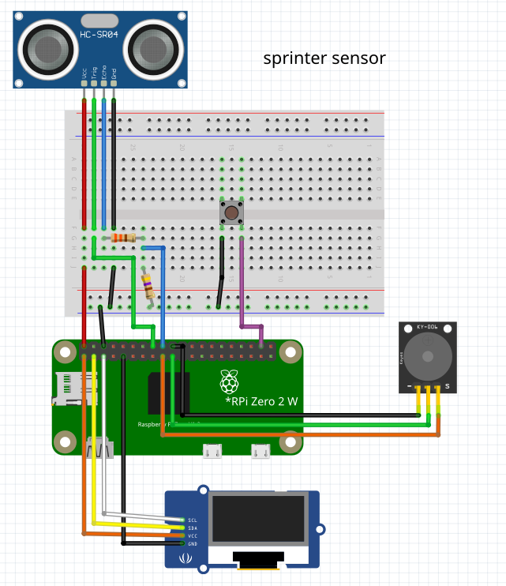
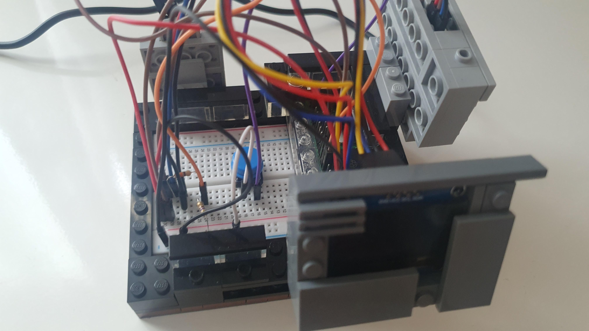
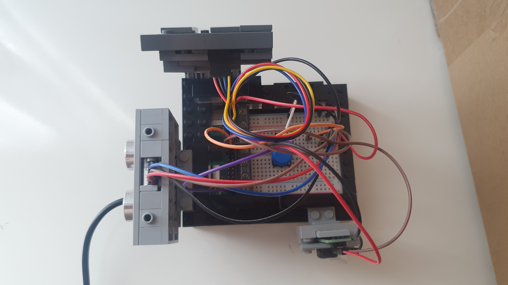
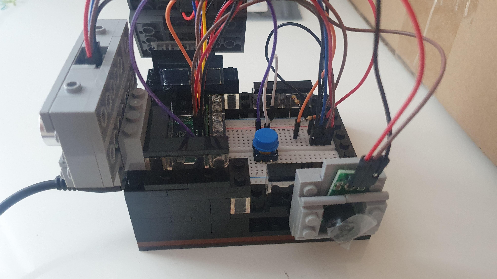
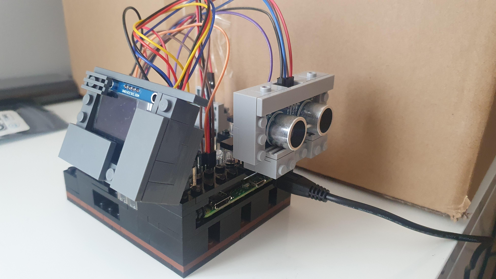

# sprinter-sensor 
Sprinter timing detection system using ultrasonic sensor and OLED display

### Installtion
```
sudo apt update
sudo apt install libjpeg-dev libfreetype6-dev python3-pil python3-smbus i2c-tools -y


python3 -m venv venv
source venv/bin/activate
pip install RPi.GPIO luma.oled
```

enable I2C
```
sudo raspi-config
i2cdetect -y 1
```
run script
```
source venv/bin/activate
python main.py  # zakładając, że to Twój plik
```


### Autostart on boot
```
sudo nano /etc/systemd/system/sprinttimer.service

//paste (change USER):
[Unit]
Description=Sprint Timer Service
After=network.target

[Service]
ExecStart=/home/USER/workspace/sprinter-sensor/venv/bin/python /home/USER/workspace/sprinter-sensor/sprinttimer.py
WorkingDirectory=/home/USER/workspace/sprinter-sensor
StandardOutput=inherit
StandardError=inherit
Restart=always
User=USER

[Install]
WantedBy=multi-user.target
```

Enable the service
```
sudo systemctl daemon-reexec
sudo systemctl daemon-reload
sudo systemctl enable sprinttimer.service
sudo systemctl start sprinttimer.service
//check status
sudo systemctl status sprinttimer.service
```
### Hot it works


### Diagram




### How it looks 🔥🔥🔥🔥




